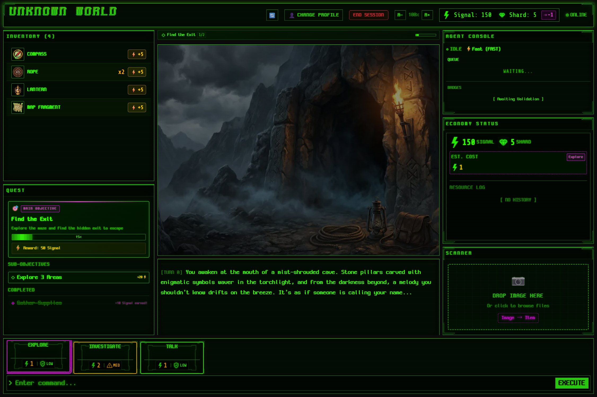
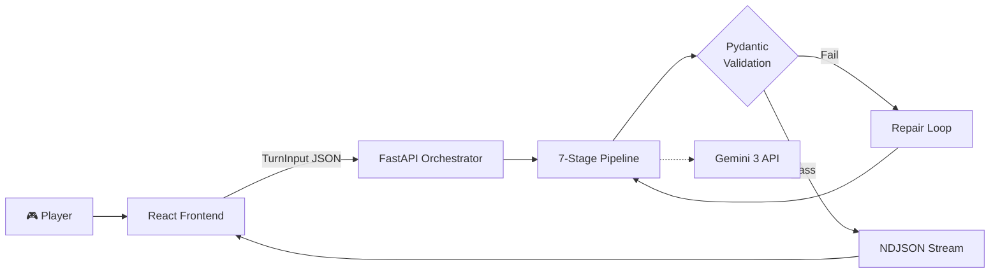

# 🌀 Unknown World

> **An infinite, procedurally generated roguelike narrative web game powered by Gemini 3's agentic Game Master.**

Unknown World is not a chatbot wrapper. It's a **stateful game system** where an AI Game Master orchestrates world state, economy, rules, and visual scenes — all delivered through a purpose-built game UI with structured outputs, dual validation, and self-repair capabilities.

🔗 **[Live Demo](#live-demo)** · 📐 **[Architecture](docs/architecture.md)** · 🤖 **[Gemini Integration](docs/gemini-integration.md)**

---



---

## ✨ Key Features

### 🎲 Agent-driven Game Master
Each turn, Gemini 3 Pro returns narrative, UI choices, state changes, and costs in a single **JSON Schema-enforced structured output**. Outputs are dual-validated by Pydantic (server) and Zod (client), with an automatic repair loop on failure.

### 👁️ Agentic Vision
Scene images are re-analyzed by Gemini 3 Flash + Code Execution to detect objects as bounding boxes (0–1000 coordinates). Detected objects become **clickable hotspots** on the Scene Canvas — interaction targets grounded in vision evidence, not text hallucination.

### 🎨 Multimodal Scene Generation
Gemini 3 Pro Image generates scene artwork matching the narrative. Text and state panels are delivered first; images load asynchronously with CRT-themed loading animations to reduce perceived wait time.

### 📷 Scanner (Photo → Item)
Upload real-world photos, and Gemini 3 Flash's vision analysis converts them into captions, detected objects, and **in-game item candidates** added to your inventory.

### ⚡ Real-time Streaming Pipeline
The server streams pipeline stages (`Parse → Validate → Plan → Resolve → Render → Verify → Commit`) and validation badges (`Schema OK` · `Economy OK` · `Safety OK` · `Consistency OK`) as NDJSON events. Narrative text is chunked for a typewriter effect.

### 🎮 Interactive Game UI (Not a Chat App)
Action Deck (cards with cost/risk), Inventory (drag & drop to use items on scene objects), Scene Canvas (clickable hotspots), Agent Console (live pipeline stages + badges), and Economy HUD (Signal/Shard balance, transaction ledger) — all permanently visible in a fixed game layout.

### 💰 Economy System
Signal/Shard currencies manage action costs. Estimated costs are shown before each action, and alternatives are suggested when balance is insufficient. All transactions are recorded in a ledger with negative-balance prevention.

---

## 🏗️ Tech Stack

| Layer | Technology |
|-------|------------|
| **Frontend** | React 19.2 · Vite 7.3 · TypeScript 5.9 · Zustand · Zod · dnd-kit · i18next |
| **Backend** | Python 3.14 · FastAPI 0.128 · Pydantic 2.12 · Uvicorn |
| **AI Models** | `gemini-3-pro-preview` (Text) · `gemini-3-flash-preview` (Fast/Vision) · `gemini-3-pro-image-preview` (Images) |
| **Streaming** | HTTP Streaming (Fetch + POST) → NDJSON events |
| **Deployment** | Docker · Cloud Run |

> See [docs/tech-stack.md](docs/tech-stack.md) for the full technical stack guide.

---

## 🏛️ Architecture

Unknown World's backend runs a **7-stage orchestrator pipeline** for every player turn:

```
Player Action → Parse → Validate → Plan → Resolve → Render → Verify → Commit → Stream Response
```

Key architectural decisions:
- **Structured Turn Contract**: All AI outputs follow a strict JSON Schema (`TurnInput` → `TurnOutput`)
- **Dual Validation**: Pydantic (server) + Zod (client) for zero-trust data integrity
- **Repair Loop**: Failed validations trigger automatic re-prompting (up to 2 retries) with a guaranteed safe fallback
- **Economy as Cost Control**: API costs are exposed as in-game currency, making cost management part of gameplay



> See [docs/architecture.md](docs/architecture.md) for the detailed architecture diagram and guide.

---

## 🤖 Gemini 3 Integration

Unknown World uses **four Gemini 3 capabilities** as its core engine:

| Capability | Model | Purpose |
|------------|-------|---------|
| **Structured Outputs** | `gemini-3-pro-preview` | JSON Schema-enforced game state, UI, and economy |
| **Image Generation** | `gemini-3-pro-image-preview` | Dynamic scene artwork with visual continuity |
| **Vision Analysis** | `gemini-3-flash-preview` + Code Execution | Hotspot detection and Scanner item extraction |
| **Streaming** | All models | Real-time typewriter effect + pipeline stage events |

**What makes it different from a prompt wrapper:**
- State accumulates across turns (WorldState, Inventory, Rules, Economy)
- Outputs are mechanically validated and auto-repaired, not just displayed
- The AI controls UI layout, not just text — action cards, hotspots, and scene composition
- Vision grounds interactions in what's actually visible, reducing hallucination

> See [docs/gemini-integration.md](docs/gemini-integration.md) for the detailed write-up (~200 words).

---

## 🚀 Quick Start

### Prerequisites

- **Node.js** 24.x
- **Python** 3.14
- **pnpm** 10.x
- **uv** (Python package manager)

### Setup

**1. Clone the repository**

```bash
git clone https://github.com/Yachaboom/unknown-world.git
cd unknown-world
```

**2. Frontend**

```bash
cd frontend
pnpm install
pnpm dev
# → http://localhost:8001
```

**3. Backend**

```bash
cd backend
cp .env.example .env
# Edit .env and set your GOOGLE_API_KEY
# Get a key at: https://aistudio.google.com/apikey

uv sync
uv run uvicorn unknown_world.main:app --reload --port 8011
# → http://localhost:8011/health
```

### Environment Variables

| Variable | Description | Default |
|----------|-------------|---------|
| `GOOGLE_API_KEY` | Gemini API key ([Get one](https://aistudio.google.com/apikey)) | *Required* |
| `UW_MODE` | `mock` (no API calls) or `real` (live Gemini) | `real` |
| `PORT` | Backend port (8011–8020) | `8011` |

> **Note**: Never commit your `.env` file. Use `.env.example` as a template.

---

## 🎮 Live Demo

🔗 **[Play Unknown World](https://unknown-world-frontend-676511950590.us-central1.run.app)** — No login required. Choose a demo profile and start playing immediately.

Three demo profiles are available:
- **🎭 The Narrator** — Story-driven exploration
- **🧭 The Explorer** — System experimentation and emergent play
- **⚙️ The Tech Enthusiast** — Multimodal and agent mechanics showcase

---

## 📁 Project Structure

```
unknown-world/
├── frontend/          # React 19 + Vite 7 — Game UI
│   ├── src/
│   │   ├── components/  # Fixed Game HUD components
│   │   ├── stores/      # Zustand state management
│   │   ├── schemas/     # Zod validation schemas
│   │   ├── api/         # Streaming & scanner clients
│   │   └── locales/     # i18n (ko-KR, en-US)
│   └── public/ui/       # Static game assets
├── backend/           # FastAPI — Orchestrator + Gemini Integration
│   ├── src/unknown_world/
│   │   ├── orchestrator/  # 7-stage pipeline + repair loop
│   │   ├── services/      # GenAI, image, vision services
│   │   ├── models/        # Pydantic schemas
│   │   ├── validation/    # Business rules + language gates
│   │   └── api/           # HTTP endpoints
│   └── prompts/           # XML-structured prompt files (ko/en)
├── shared/            # Shared JSON schemas
├── docs/              # English documentation
│   ├── architecture.md
│   ├── gemini-integration.md
│   ├── prd.md
│   └── tech-stack.md
└── scripts/           # Build and utility scripts
```

---

## 🌐 Language Support

Unknown World supports **English (en-US)** and **Korean (ko-KR)**. English is the default language. Language can be switched at session start — switching resets the session to prevent mixed-language output.

---

## 📜 License

This project was built for the [Google Gemini 3 Hackathon](https://googlegeminihackathon.devpost.com/).
