# [Unknown World] Architecture Guide

## System Architecture Diagram

```mermaid
flowchart TD
    Player(("🎮 Player")) -->|"Click · Drag · Type · Upload"| UI

    subgraph Client["Frontend — React 19 + Vite 7 + TypeScript"]
        UI["Game UI<br/><i>Action Deck · Inventory DnD<br/>Scene Canvas · Agent Console</i>"]
        ZS["Zustand Stores<br/><i>World · Economy · Inventory · Agent</i>"]
        ZV["Zod Schema Validation"]
    end

    subgraph Server["Backend — FastAPI + Python 3.14"]
        API["HTTP Streaming API<br/><code>POST /api/turn</code>"]
        PIPE["7-Stage Orchestrator"]
        PV["Pydantic Validation"]
        RL["Repair Loop<br/><i>Auto-repair + Safe Fallback</i>"]
    end

    subgraph Pipeline["Orchestrator Pipeline Stages"]
        direction LR
        S1["Parse"] --> S2["Validate"] --> S3["Plan"] --> S4["Resolve"] --> S5["Render"] --> S6["Verify"] --> S7["Commit"]
    end

    subgraph Gemini["Gemini 3 API"]
        GT["📝 Text Generation<br/><i>gemini-3-pro-preview (QUALITY)<br/>gemini-3-flash-preview (FAST)</i>"]
        GI["🎨 Image Generation<br/><i>gemini-3-pro-image-preview</i>"]
        GV["👁️ Vision Analysis<br/><i>gemini-3-flash-preview<br/>+ Code Execution</i>"]
    end

    UI -->|"TurnInput (JSON)"| API
    API --> PIPE
    PIPE --> Pipeline
    S7 --> PV
    PV -->|"❌ Schema Fail"| RL
    RL -->|"🔄 Retry"| PIPE
    PV -->|"✅ Pass"| API
    API -->|"NDJSON Stream<br/><i>stages · badges · narrative · final</i>"| UI
    UI --> ZV
    ZV --> ZS

    PIPE -.->|"Structured Outputs<br/>(JSON Schema)"| GT
    PIPE -.->|"Scene Generation"| GI
    PIPE -.->|"Agentic Vision<br/>(Hotspot Detection)"| GV

    style Client fill:#1a1a2e,stroke:#33ff00,color:#33ff00
    style Server fill:#1a1a2e,stroke:#ff00ff,color:#ff00ff
    style Gemini fill:#1a1a2e,stroke:#4285f4,color:#4285f4
    style Pipeline fill:#0d0d0d,stroke:#33ff00,color:#33ff00
```



### Data Flow Summary

1. **Player** interacts via clicks, drag-and-drop, text input, or image upload
2. **Frontend** sends a `TurnInput` JSON to the backend via HTTP POST
3. **Orchestrator** processes the turn through 7 pipeline stages
4. **Gemini 3 API** generates text, images, and vision analysis as needed
5. **Pydantic** validates the output; failures trigger the **Repair Loop**
6. **Backend** streams results as NDJSON events (stages, badges, narrative, final)
7. **Frontend** validates with **Zod** and updates **Zustand** stores to render the game UI

---

## 1. System Overview

**Unknown World** is a roguelike narrative web game powered by an agentic world engine. It combines a stateful orchestrator with a high-fidelity game UI, using Gemini 3's multimodal capabilities to create an infinite, playable universe.

## 2. Project Structure

### Directory Tree

```text
backend/
├── prompts/ (XML-structured .md files)
│   ├── image/, scan/, system/, turn/, vision/
├── src/unknown_world/
│   ├── api/            # API Endpoints (FastAPI)
│   ├── artifacts/      # Ending reports and session artifacts
│   ├── config/         # System settings, models, and economy rules
│   ├── harness/        # Replay and automated validation engine
│   ├── models/         # Pydantic schemas (TurnOutput, etc.)
│   ├── orchestrator/   # 7-stage pipeline and repair logic
│   ├── services/       # GenAI, image, and vision services
│   ├── storage/        # File system abstraction and validation
│   └── validation/     # Business rules and language gates
└── tests/              # Unit and integration tests

frontend/src/
├── api/                # Streaming and scanner API clients
├── components/         # Fixed Game HUD (ActionDeck, Canvas, etc.)
├── locales/            # i18n JSON resources
├── schemas/            # Zod validation schemas
├── stores/             # Zustand state management (World, Economy, etc.)
├── turn/               # Turn runner and async logic
└── style.css           # Global CRT theme and layout

docs/                   # Public English documentation
├── prd.md
├── tech-stack.md
└── architecture.md
```

## 3. Core Architecture Principles

### 3.1 Stateful Orchestrator
The system maintains a continuous `WorldState` and `ConversationHistory`. Each player action triggers a transformation of this state rather than just a text response.

### 3.2 Structured Turn Contract
All communication between the client and server is enforced via strict JSON schemas. This allows the AI to control game logic, economy, and UI layout mechanically.

### 3.3 Resilient 7-Stage Pipeline
Turn processing follows a standardized sequence:
`Parse` → `Validate` → `Plan` → `Resolve` → `Render` → `Verify` → `Commit`

- **Repair Loop**: If an output fails validation, the system automatically attempts to repair it using specialized prompts.
- **Safe Fallback**: In case of persistent failure, a guaranteed safe response is returned to prevent game crashes.

### 3.4 Multimodal Integration
- **Text-first Streaming**: Narrative is delivered immediately via HTTP streaming.
- **Agentic Vision**: The engine re-analyzes generated images to detect hotspots and grounded interaction targets.
- **Late-binding Images**: Artwork loads asynchronously to reduce perceived latency, with guards to ensure synchronization.

### 3.5 Economy-driven AI Control
API costs and model tiers are exposed as game mechanics (Signal/Shard). This turns cost management into a strategic element for the player.

## 4. Dual Validation System
Every `TurnOutput` is validated twice:
1. **Server-side (Pydantic)**: Ensures schema compliance and business rule integrity before streaming.
2. **Client-side (Zod)**: Performs a final check before rendering to ensure the UI can safely consume the data.
